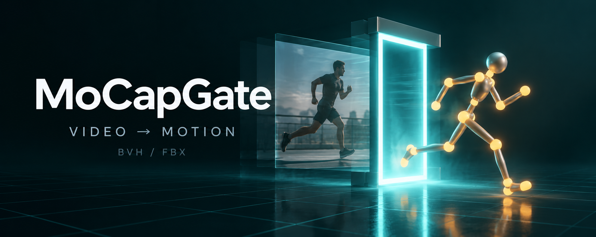
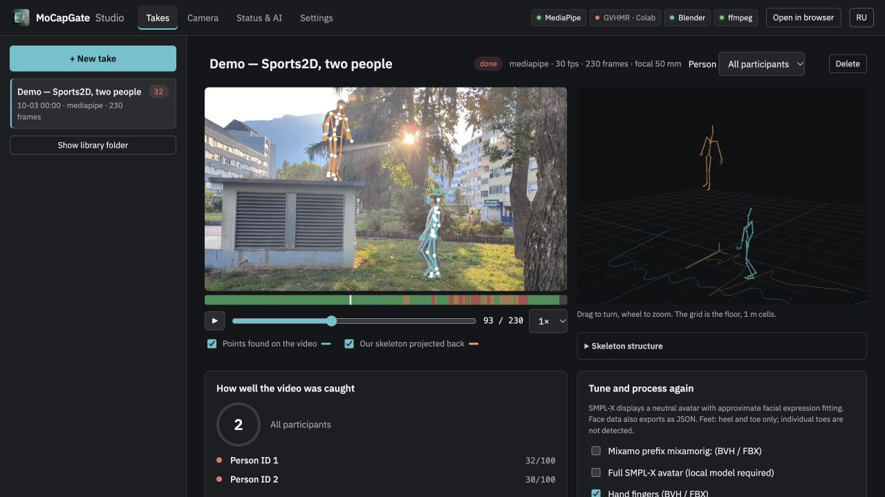
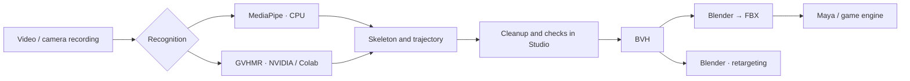
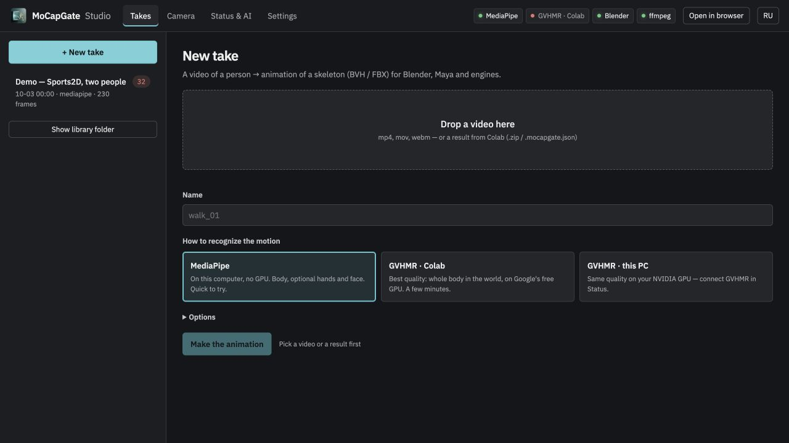
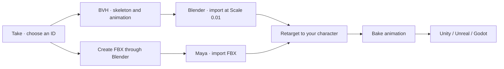

# MoCapGate

[Русский](README.md) · **English**



**Character animation from an ordinary video.** Film a person with a phone or webcam, recover skeleton motion, check it alongside the original footage, and export it to **Blender, Maya or a game engine**. No motion capture suit is required.

MoCapGate Studio is a local application for **macOS, Windows and Linux**, with Russian and English interfaces. MediaPipe runs on the CPU; GVHMR can run on NVIDIA hardware or in Google Colab. It is a tool for animation prototyping and preparation: complex motion still needs inspection and manual cleanup.

[Download 0.3.2](https://github.com/MaverickGH/app-releases/releases/tag/mocapgate-v0.3.2) · [Report an issue](https://github.com/MaverickGH/mocapgate/issues) · [MIT](LICENSE)

[Features](#features) · [Installation](#installation) · [First take](#your-first-take) · [Camera](#recording-with-a-camera) · [Settings](#settings-and-cleanup) · [GVHMR](#gvhmr-in-colab-and-on-nvidia) · [Export](#export-to-blender-maya-and-engines) · [CLI](#command-line) · [Troubleshooting](#troubleshooting)

## Features

- **Video → body animation.** Local MediaPipe or GVHMR with motion estimation in world coordinates.
- **Multiple people.** Separate IDs, a shared timeline, simultaneous viewing and individual BVH/FBX files. Detection limit: 1–8, default 4. Group capture is experimental.
- **In-app camera.** Device, resolution and FPS selection, countdown, live framing checks, recording and take creation.
- **Playback and checks.** Original video, detected points, projected skeleton, 3D view, quality strip and advice on what to film again.
- **Cleanup.** One Euro smoothing, foot locking through root correction, camera focal length estimation and in-place motion.
- **Optional hands and face.** Fingers are added to BVH/FBX; facial points and expression coefficients are available in JSON. Detail tracking needs the source video.
- **Neutral SMPL-X avatar.** Optional body surface, bones or combined viewing; requires your own model and a separate torch/smplx environment.
- **Export.** Direct BVH, FBX through an installed Blender. Mixamo-style bone names, with an optional `mixamorig:` prefix.



*Actual 0.3.1 interface with the prepared Sports2D example. Low scores of 32/100 and 30/100 illustrate this capture's limitations; the example demonstrates playback and IDs, not motion accuracy against ground truth.*



## Installation

Native packages: **[MoCapGate 0.3.2](https://github.com/MaverickGH/app-releases/releases/tag/mocapgate-v0.3.2)**. They include CPython 3.12.13 and uv; Studio needs no system Python. Choose the matching OS and architecture.

| Platform | Installer | Portable package |
|---|---|---|
| macOS · Apple Silicon | [dmg](https://github.com/MaverickGH/app-releases/releases/download/mocapgate-v0.3.2/MoCapGate-0.3.2-macos-arm64.dmg) | [ZIP](https://github.com/MaverickGH/app-releases/releases/download/mocapgate-v0.3.2/MoCapGate-0.3.2-macos-arm64-native.zip) |
| macOS · Intel | [dmg](https://github.com/MaverickGH/app-releases/releases/download/mocapgate-v0.3.2/MoCapGate-0.3.2-macos-x64.dmg) | [ZIP](https://github.com/MaverickGH/app-releases/releases/download/mocapgate-v0.3.2/MoCapGate-0.3.2-macos-x64-native.zip) |
| Windows 10/11 · x64 | [exe](https://github.com/MaverickGH/app-releases/releases/download/mocapgate-v0.3.2/MoCapGate-0.3.2-windows-x64-setup.exe) | [ZIP](https://github.com/MaverickGH/app-releases/releases/download/mocapgate-v0.3.2/MoCapGate-0.3.2-windows-x64-native.zip) |
| Linux · x64 | [AppImage](https://github.com/MaverickGH/app-releases/releases/download/mocapgate-v0.3.2/MoCapGate-0.3.2-linux-x64.AppImage) | [ZIP](https://github.com/MaverickGH/app-releases/releases/download/mocapgate-v0.3.2/MoCapGate-0.3.2-linux-x64-native.zip) |

On macOS copy the app from the DMG into Applications; on Windows run the EXE. Linux also has DEB and AppImage packages. Portable ZIPs use `START.sh` (macOS/Linux) or `START_WINDOWS.cmd`. Do not mix architectures. Checksums are in `SHA256SUMS.txt`.

**Install inference separately:** Studio → Status & AI → MediaPipe → Install. Initial downloads need internet and disk space. FBX needs Blender; local GVHMR needs NVIDIA/CUDA and its own environment. No SMPL-X model is included.

The public Git contains loaders, libraries for four platforms and integration source. Originals of eight selected modules are kept separately. Running a clone requires matching Python 3.12.13; ready-made packages are the easiest way to use Studio.

Builds are currently unsigned. macOS may require allowing the app in Privacy & Security; Windows may display SmartScreen. Additional manual setup and build details are in [docs/install.md](docs/install.md) (Russian).

#In the CLI examples below, `python3` means matching Python 3.12.13. Native ZIPs use `python/bin/python3.12` (macOS/Linux) or `python\python.exe` (Windows).

## Run a public clone

```bash
git clone https://github.com/MaverickGH/mocapgate.git
cd mocapgate
python3.12 mocapgate.py studio
```

Studio opens in the browser on `127.0.0.1` with a random port and a session token. On Windows, use `python` instead of `python3` in these examples. Dependency setup from a clone is available through `scripts/start_windows.cmd` and `scripts/start_macos.command`.

To download web libraries for subsequent offline viewing, run `python3 scripts/vendor_web.py`. Distributed packages already include them; a source checkout without `vendor/` loads those libraries from a CDN.

## Your first take

1. Open **Status & AI**. Check Python and MediaPipe. If MediaPipe is missing, click **Install**. Start with **heavy**; its environment takes approximately 1 GB.
2. Record a short clip: a stationary camera, even light and the whole body from head to feet. Start with one person and a simple movement.
3. Under **Takes → + New take**, drop a video or click the upload area to select it. MP4/H.264 is a useful starting point. MOV/WebM and other video files may need FFmpeg conversion for browser playback.
4. Choose **MediaPipe** and enter a name. For one person, set **Maximum people = 1**; for a group, set a suitable limit. Leave fingers, face and body surface disabled for your first attempt if you do not need them.
5. Click **Make the animation**. Processing time depends on clip length, people, model and hardware; wait for the **done** status.
6. Play the take. Compare the points and skeleton against the video; inspect feet, hands, orientation and trajectory in 3D. Read the advice below the viewer.
7. Adjust smoothing, root motion or focal length if needed, then click **Process again**. Download BVH or create FBX.



**Try it without your own video or a body model.** From the clone or portable package root:

```bash
python3 scripts/install_example.py .
python3 mocapgate.py studio
```

This adds **Demo — Sports2D, two people** to your library and preserves an existing copy. Playback does not require MediaPipe; reprocessing does. Source and BSD-3-Clause licensing: [examples/sports2d/README.txt](examples/sports2d/README.txt).

## Recording with a camera

Open **Camera → Turn on the camera**, allow camera access, and choose the device, resolution, FPS and countdown. Enable **Live check: skeleton and hints**, check lighting and framing, press **Record**, then **Stop → Make a take from it**.

The live check helps frame the shot; the saved recording undergoes separate recognition. If the desktop window cannot access the camera, use **Open in browser** and check camera permissions there. FFmpeg helps convert recordings into MP4 with a constant frame rate; quickstart installs it.

For full-body capture, place the camera around waist height, leave space around feet and hands, and avoid strong backlight or clothing that hides joints. Stand still for about a second at the beginning and end. Keep people separated when filming a group.

**At a desk:** MediaPipe automatically detects poorly visible legs and uses upper-body processing. Legs remain straight, foot locking is disabled, and the report shows a warning. Hidden leg motion is not recovered.

## Settings and cleanup

| Setting | When to change it |
|---|---|
| **MediaPipe model** | `lite` is faster, `full` is intermediate, `heavy` is for more thorough recognition |
| **Smoothing** | Increase it for jitter; too much removes fast motion details |
| **Root motion** | “Move as in the video” keeps the estimated path; “In place” suits loops or characters moved by game code |
| **Pin the feet** | Reduces sliding by correcting the root; full leg IK is not implemented yet |
| **Camera focal length** | `0` estimates it automatically; if the overlay drifts, try the known 35 mm equivalent of your camera |
| **Frame rate** | `0` uses the file. Change only when you know the intended FPS; this does not generate intermediate frames |
| **Maximum people** | Limits simultaneous detections; it does not select the participant to export |
| **Hand fingers / face** | Enable when details are large enough and visible; adds processing work |
| **Mixamo prefix** | Adds `mixamorig:` to bone names during reprocessing/export; does not retarget onto your character automatically |

Smoothing, root motion and focal length reuse saved recognition results. Changing the MediaPipe model or people limit requires a new recognition cache. Take options and application defaults are separate: changing **Settings** does not replace options in an existing take.

**Reading the checks:** the 0–100 score is a heuristic for visibility, gaps, jitter, sliding and agreement with the image. It is not an accuracy percentage against professional motion capture. The quality strip helps locate problematic sections; select an individual ID for a detailed group-capture report.

### Multiple people

**All participants** shows the skeletons together; an individual **ID** selects the report, download and Blender/Maya actions. **Make FBX** exports every participant; download the desired ID afterwards. Group files use a `_person_<ID>` suffix and share the same FPS and timeline length.

After a long disappearance, a person may receive a new ID; occlusion can swap IDs. Depth and relative positions are approximate. A limit of 8 does not guarantee reliable capture of eight people in a crowd. [Details](docs/multiple-people.md) · [Real-video checks](docs/multiple-people-real-test.md) (Russian).

### Hands, face and body surface

Hands provide 21 observed points per hand and 30 additional finger bones. Face tracking provides 478 points and 52 expression coefficients in JSON. Small or occluded details may be missed; body quality scores do not measure finger accuracy. Individual toes are not tracked.

For **Full SMPL-X avatar**, obtain your own `SMPLX_NEUTRAL.npz` from the [model authors](https://smpl-x.is.tue.mpg.de), prepare a CPU torch/smplx environment with the quickstart script and that model, and enable the take option. From the extracted package or clone:

```bash
# macOS
bash scripts/setup_macos.sh --smplx-model "$HOME/Models/SMPLX_NEUTRAL.npz"
```

```powershell
# Windows
powershell -NoProfile -ExecutionPolicy Bypass -File scripts/setup_windows.ps1 -FullAvatar -SmplxModel "C:\Models\SMPLX_NEUTRAL.npz"
```

Linux users can connect an existing Python with torch/smplx using **Settings → Python of the GVHMR environment**, alongside the model path. The 3D viewer offers **Body**, **Bones**, and **Body + bones**.

The avatar is neutral: clothing and personal appearance are not reconstructed, and expression fitting is approximate. **BVH/FBX contains the skeleton; surface data and expression coefficients remain in the take**, with face data available separately as JSON.

## GVHMR in Colab and on NVIDIA

| Option | Requirements | Where the video goes |
|---|---|---|
| **MediaPipe** | CPU and the installed component | Stays on your computer |
| **GVHMR · Colab** | Google account, available GPU, licensed SMPL-X | You upload it to Google Colab |
| **GVHMR · this PC** | NVIDIA/CUDA, separate GVHMR, weights and SMPL-X | Stays on your computer |

GVHMR is an alternative backend for more stable body and trajectory estimation. Improvements depend on the scene; either path can need manual correction. Free Colab GPUs depend on service availability and usage limits.

### Colab, step by step

1. Create a take with **GVHMR · Colab**. The video stays in the local take while it waits for the result.
2. Download the [notebook](colab/MoCapGate_GVHMR.ipynb) from the app or repository. In [Google Colab](https://colab.research.google.com), choose **File → Upload notebook**, then select a GPU runtime such as T4.
3. Read the initial cells, set parameters, and run cells in order. Upload your **SMPL-X v1.1 NPZ / `SMPLX_NEUTRAL.npz`**, then **the same video** used for the take.
4. Wait for processing and download `*_mocapgate.zip`.
5. Drop the ZIP into the waiting take. Studio imports, checks and exports it. Enable hand/face options and process again locally if required.

You can also drop an existing ZIP into a **new take**. Without source video, the result can play in 3D, but video comparison and new detail tracking are unavailable.

### Local GPU

Install GVHMR using its [official instructions](https://github.com/zju3dv/GVHMR/blob/main/docs/INSTALL.md), download its weights and your own SMPL-X model. In **Settings**, enter the GVHMR folder, the Python executable of its environment, and the model path. Check **Status & AI**, then select **GVHMR · this PC**. Enable the stationary-camera option for a fixed camera.

This path requires NVIDIA/CUDA. On Mac, use MediaPipe or Colab; the CPU environment for SMPL-X surface generation does not replace local GVHMR.

## Export to Blender, Maya and engines



### Blender

Download BVH → **File → Import → Motion Capture (.bvh)** → **Scale = 0.01** (BVH is written in centimetres). An animated armature appears. Check FPS, scale and root motion. **Open in Blender** performs the prepared import if Blender is detected.

To animate your own character, map the source skeleton to its rig, configure retargeting and bake the result. Mixamo-style names help mapping but do not replace proportion and rest-pose adjustments. [Details](targets/blender/README.md) (Russian).

### Maya

Install Blender for conversion, click **Make FBX**, download the result and import it into Maya. Connect source and target skeletons through **HumanIK**, check character definitions and bake motion onto the target rig. **Open FBX in Maya** is available when Maya is detected. [Details](targets/maya/README.md) (Russian).

### Game engines

Import the prepared FBX, or export a character with baked animation from Blender/Maya in the required format. Humanoid rig settings, scale and root motion depend on the engine. MoCapGate does not currently export glTF directly. [Engine workflow](targets/engines/README.md) (Russian).

The related [MeshGate](https://github.com/MaverickGH/meshgate) project helps with meshes and assets; it is not required to use MoCapGate.

## Command line

Run commands from the project root. On Windows, replace `python3` with `python`. Quote paths containing spaces.

```bash
# Inspect the environment and open Studio
python3 mocapgate.py doctor
python3 mocapgate.py studio

# Install MediaPipe (uv must be available first)
python3 mocapgate.py setup mediapipe --model heavy

# Create a take for one person, or choose a suitable group limit
python3 mocapgate.py new clip.mp4 --backend mediapipe --max-people 1
python3 mocapgate.py new duet.mp4 --backend mediapipe --max-people 2

# Reprocess a take / create FBX (use the path printed by new)
python3 mocapgate.py process "/path/to/take"
python3 mocapgate.py process "/path/to/take" --fbx

# Convert an existing GVHMR JSON; .pt needs torch, .npz needs numpy
python3 mocapgate.py result.mocapgate.json -o motion.bvh

# Check BVH export without models, video or recognition
python3 mocapgate.py --demo demo.bvh
```

When importing a multi-person scene, direct GVHMR conversion writes separate `motion_person_<ID>.bvh` files. For group video, use `new` or Studio: the short `clip.mp4 -o motion.bvh` command copies only the primary BVH from the created take.

## Files and privacy

Takes default to **`~/Documents/MoCapGate Takes`**. Each take is a folder containing `take.json`, source video, recognition cache and results. Metadata lists BVH/FBX, reports, overlays and detail files; their presence depends on enabled options. Deleting a take in Studio moves it to `.trash` inside the library.

Settings: macOS — `~/Library/Application Support/MoCapGate/settings.json`; Windows — `%APPDATA%\MoCapGate\settings.json`; Linux — `~/.config/mocapgate/settings.json` or `XDG_CONFIG_HOME`. Change the takes folder in the app, or use `MOCAPGATE_HOME` and `MOCAPGATE_LIBRARY` for isolated runs.

Studio listens only on loopback and uses a session token. Local MediaPipe/GVHMR do not upload video to the cloud. Model and library installation involves network downloads; Colab involves your upload of video and the model to Google. [Architecture](docs/architecture.md) (Russian).

## Troubleshooting

| Symptom | Check |
|---|---|
| Python not found | Use quickstart or install Python; desktop runs can use `MOCAPGATE_PYTHON` |
| MediaPipe will not run | Status & AI, uv and the model; installation needs internet access |
| Black video / no preview | Check FFmpeg and try MP4/H.264; a recognised container may not play in the browser |
| Camera unavailable | OS/browser permissions, another app using the device; try Open in browser |
| 3D will not load from source | Download local libraries: `python3 scripts/vendor_web.py` |
| Jitter / foot sliding | Lighting, body visibility, smoothing and foot locking; compare with GVHMR if needed |
| No individual download button | Switch All participants to a specific ID |
| FBX fails | Install Blender and check its path in Settings; BVH does not need Blender |
| SMPL-X surface fails | Check your model and Python with torch/smplx; MediaPipe alone is insufficient |
| IDs swap | Separate people, reduce occlusion and inspect the group report |

When filing an [issue](https://github.com/MaverickGH/mocapgate/issues), include your OS, version, backend, steps and error text. If needed, attach a short sample you can share publicly. Desktop logs: macOS — `~/Library/Logs/dev.mocapgate.studio/studio.log`; Windows — `%LOCALAPPDATA%\dev.mocapgate.studio\logs\studio.log`.

## Development

| Location | Purpose |
|---|---|
| `mocapgate.py`, `core/` | CLI, backends, tracking, retargeting, checks and export |
| `apps/studio/` | Python server, interface without a build step, Tauri shell |
| `colab/`, `tools/` | GVHMR notebook, notebook generator and video checks |
| `scripts/` | Dependency setup, packaging, sample installation and artwork generation |
| `examples/`, `tests/fixtures/` | Licensed sample and regression data |
| `docs/`, `targets/` | Installation, architecture, limitations and DCC import |

```bash
python3 -m unittest discover tests
python3 tools/build_colab.py
# Regeneration should match the committed notebook
git diff --exit-code colab/
```

Desktop builds require Node 20+, stable Rust and platform build tools. Windows needs Visual Studio C++ Build Tools and a Windows SDK; Linux needs WebKitGTK development libraries (see the installation guide).

```bash
export MOCAPGATE_NATIVE_PACKAGE="$PWD/dist/native-package"
cd apps/studio/desktop
npm ci
npx tauri build
```

[Build requirements](docs/install.md#сборка-установщиков) · [Studio](apps/studio/README.md) · [Roadmap](docs/roadmap.md) · [Repository audit](docs/repository-audit.md). These supporting documents are in Russian; this README covers the user workflow in English.

## Licences and limitations

**MoCapGate code is [MIT](LICENSE)**. MediaPipe and OpenCV are Apache-2.0; other components are listed in [THIRD_PARTY_NOTICES.md](THIRD_PARTY_NOTICES.md). Sports2D footage carries its own BSD-3-Clause licence.

GVHMR and the downloaded SMPL-X model have separate terms restricting use to non-commercial activities: [GVHMR](https://github.com/zju3dv/GVHMR/blob/main/LICENSE), [SMPL-X](https://smpl-x.is.tue.mpg.de/modellicense.html). This repository's MIT licence does not replace those terms. The licensed model is not included in source code or installers.

A single camera cannot guarantee correct depth, person-to-person contact, hidden joint rotation or precise expressions. Inspect the export on your character. See the [real-video report](docs/multiple-people-real-test.md) for recorded checks and their limits (Russian).

## Native packaging

Eight modules are distributed as native libraries; packages include CPython
3.12.13. Libraries are selected by OS and architecture. MIT remains in effect.
[Build, verification and publication guide](docs/code-protection.en.md).
