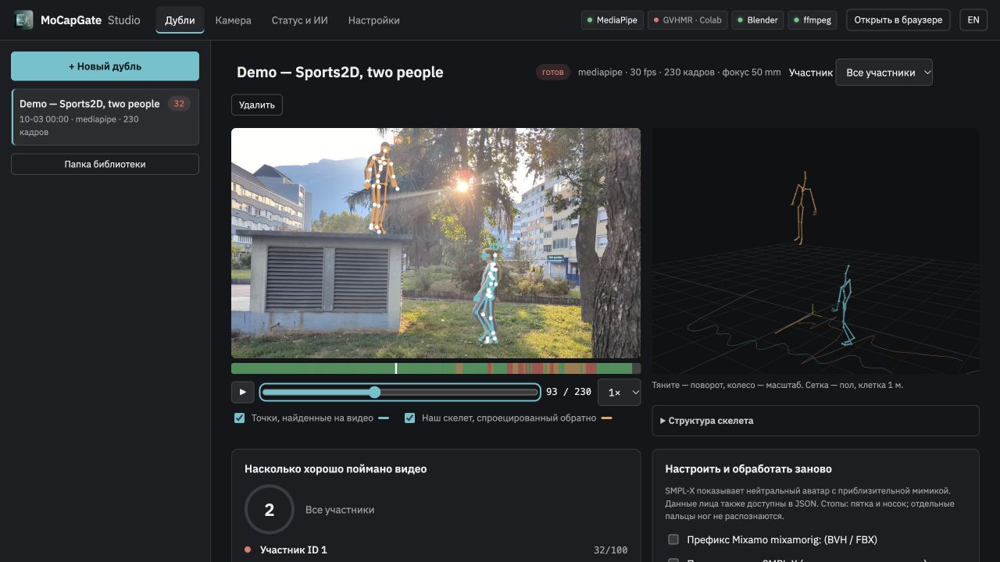
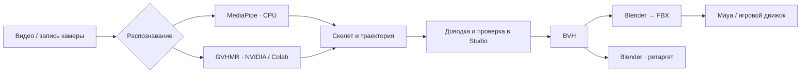
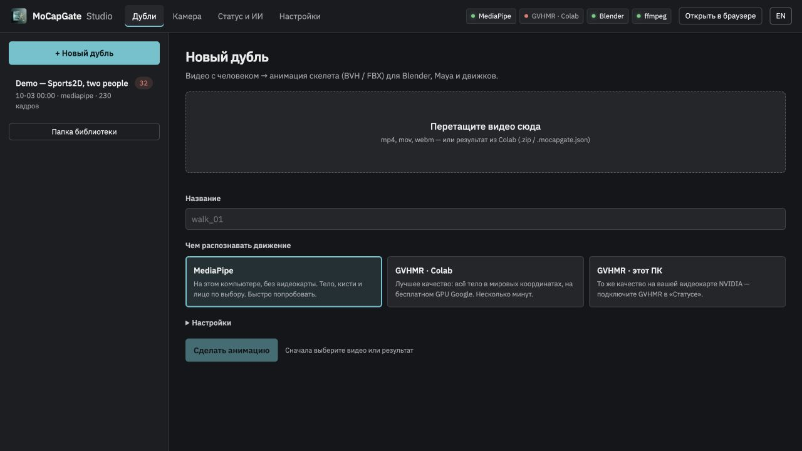
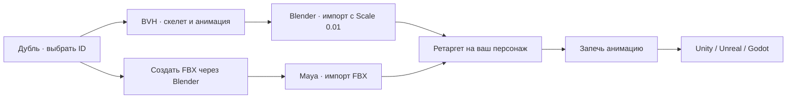

# MoCapGate

**Русский** · [English](README.en.md)


**Анимация персонажа из обычного видео.** Снимите человека на телефон или веб-камеру, получите движение скелета, проверьте его рядом с исходником и экспортируйте в **Blender, Maya или игровой движок**. Костюм для захвата движения не нужен.

MoCapGate Studio — локальное приложение для **macOS, Windows и Linux** с интерфейсом на русском и английском. MediaPipe работает на CPU; GVHMR можно запустить на NVIDIA или в Google Colab. Это инструмент для прототипирования и подготовки анимации: сложные движения требуют проверки и ручной доводки.

[Скачать 0.3.2](https://github.com/MaverickGH/app-releases/releases/tag/mocapgate-v0.3.2) · [Сообщить о проблеме](https://github.com/MaverickGH/mocapgate/issues) · [MIT](LICENSE)

[Возможности](#возможности) · [Установка](#установка) · [Первый дубль](#первый-дубль) · [Камера](#запись-с-камеры) · [Настройки](#настройки-и-доводка) · [GVHMR](#gvhmr-в-colab-и-на-nvidia) · [Экспорт](#экспорт-в-blender-maya-и-движки) · [CLI](#командная-строка) · [Проблемы](#если-что-то-не-работает)

## Возможности

- **Видео → анимация тела.** Локальный MediaPipe или GVHMR с оценкой движения в мировых координатах.
- **Несколько людей.** Отдельные ID, общий таймлайн, совместный просмотр и отдельные BVH/FBX. Предел обнаружения — 1–8, по умолчанию 4. Групповой режим экспериментальный.
- **Камера в приложении.** Выбор камеры, разрешения и FPS, обратный отсчёт, живая проверка кадра, запись и создание дубля.
- **Просмотр и проверка.** Исходное видео, найденные точки, обратная проекция скелета, 3D, полоса качества и советы по пересъёмке.
- **Доводка.** Сглаживание One Euro, фиксация стоп с коррекцией корня, оценка фокуса камеры и режим движения на месте.
- **Кисти и лицо по выбору.** Пальцы добавляются в BVH/FBX; точки лица и коэффициенты мимики доступны в JSON. Для деталей нужен исходный видеоряд.
- **Нейтральный аватар SMPL-X.** Дополнительный просмотр поверхности, костей или поверхности с костями; нужны собственная модель и отдельное окружение torch/smplx.
- **Экспорт.** BVH напрямую, FBX через установленный Blender. Имена костей в стиле Mixamo, опциональный префикс `mixamorig:`.



*Реальный интерфейс 0.3.1, подготовленный пример Sports2D. Низкие оценки 32/100 и 30/100 показывают ограничения этого захвата; пример проверяет воспроизведение и ID, а не эталонную точность движения.*



## Установка

Готовые нативные пакеты: **[MoCapGate 0.3.2](https://github.com/MaverickGH/app-releases/releases/tag/mocapgate-v0.3.2)**. Они включают CPython 3.12.13 и uv; устанавливать системный Python для Studio не требуется. Выберите свою ОС и архитектуру.

| Система | Установщик | Без установки |
|---|---|---|
| macOS · Apple Silicon | [dmg](https://github.com/MaverickGH/app-releases/releases/download/mocapgate-v0.3.2/MoCapGate-0.3.2-macos-arm64.dmg) | [ZIP](https://github.com/MaverickGH/app-releases/releases/download/mocapgate-v0.3.2/MoCapGate-0.3.2-macos-arm64-native.zip) |
| macOS · Intel | [dmg](https://github.com/MaverickGH/app-releases/releases/download/mocapgate-v0.3.2/MoCapGate-0.3.2-macos-x64.dmg) | [ZIP](https://github.com/MaverickGH/app-releases/releases/download/mocapgate-v0.3.2/MoCapGate-0.3.2-macos-x64-native.zip) |
| Windows 10/11 · x64 | [exe](https://github.com/MaverickGH/app-releases/releases/download/mocapgate-v0.3.2/MoCapGate-0.3.2-windows-x64-setup.exe) | [ZIP](https://github.com/MaverickGH/app-releases/releases/download/mocapgate-v0.3.2/MoCapGate-0.3.2-windows-x64-native.zip) |
| Linux · x64 | [AppImage](https://github.com/MaverickGH/app-releases/releases/download/mocapgate-v0.3.2/MoCapGate-0.3.2-linux-x64.AppImage) | [ZIP](https://github.com/MaverickGH/app-releases/releases/download/mocapgate-v0.3.2/MoCapGate-0.3.2-linux-x64-native.zip) |

На macOS перенесите приложение из DMG в Applications; на Windows запустите EXE. Для Linux доступны также DEB и AppImage. В переносном ZIP используйте `START.sh` (macOS/Linux) или `START_WINDOWS.cmd`. Не смешивайте пакеты разных архитектур. `SHA256SUMS.txt` содержит контрольные суммы.

**Распознавание устанавливается отдельно:** Studio → «Статус и ИИ» → MediaPipe → «Установить». Первое скачивание требует интернета и места на диске. Для FBX нужен Blender; для локального GVHMR — NVIDIA/CUDA и собственное окружение. Модель SMPL-X не входит в пакеты.

Публичный Git содержит загрузчики, библиотеки четырёх платформ и исходники интеграций. Оригиналы восьми выбранных модулей хранятся отдельно. Для запуска клона нужен Python 3.12.13 подходящей архитектуры; для обычного использования удобнее готовый пакет.

Сборки пока без подписи. macOS может потребовать разрешить открытие приложения в «Конфиденциальность и безопасность», Windows — показать SmartScreen. Подробности и ручная установка: [docs/install.md](docs/install.md).

#В CLI-примерах ниже `python3` означает подходящий Python 3.12.13. В нативном ZIP используйте `python/bin/python3.12` (macOS/Linux) или `python\python.exe` (Windows).

## Запуск публичного клона

```bash
git clone https://github.com/MaverickGH/mocapgate.git
cd mocapgate
python3.12 mocapgate.py studio
```

Studio откроется в браузере на `127.0.0.1` со случайным портом и токеном сессии. На Windows в примерах используйте `python` вместо `python3`. Для подготовки зависимостей из клона доступны `scripts/start_windows.cmd` и `scripts/start_macos.command`.

Чтобы скачать веб-библиотеки для последующего офлайн-просмотра, выполните `python3 scripts/vendor_web.py`. Готовые пакеты уже содержат их; при запуске исходников без `vendor/` интерфейс получает библиотеки с CDN.

## Первый дубль

1. Откройте **«Статус и ИИ»**. Проверьте Python и MediaPipe. Если MediaPipe отсутствует, нажмите **«Установить»**. Для первого опыта выберите модель **heavy**; установка окружения занимает примерно 1 ГБ.
2. Снимите короткое видео: неподвижная камера, ровный свет, всё тело от головы до стоп. Начните с одного человека и простого движения.
3. В **«Дубли» → «+ Новый дубль»** перетащите видео или выберите его нажатием на область загрузки. Лучше начать с MP4/H.264. MOV/WebM и другие видео могут потребовать перекодирования FFmpeg для браузерного просмотра.
4. Выберите **MediaPipe**, задайте имя. В настройках для одного человека поставьте **«Максимум людей» = 1**; для группы — подходящий предел. Пальцы, лицо и поверхность на первый запуск можно оставить выключенными.
5. Нажмите **«Сделать анимацию»**. Время зависит от длительности, числа людей, модели и компьютера; дождитесь статуса **«готов»**.
6. Проиграйте дубль. Сравните точки и скелет с видео, проверьте стопы, руки, направление и траекторию в 3D. Прочитайте советы под просмотром.
7. При необходимости измените сглаживание, движение корня или фокус и нажмите **«Обработать заново»**. Затем скачайте BVH либо создайте FBX.



**Можно попробовать без своего видео и без модели тела.** Из корня клона или переносного пакета:

```bash
python3 scripts/install_example.py .
python3 mocapgate.py studio
```

Команда добавляет готовый дубль **Demo — Sports2D, two people** в библиотеку и не заменяет уже существующий пример. Для просмотра MediaPipe не требуется; для повторного распознавания его нужно установить. Источник и BSD-3-Clause лицензия: [examples/sports2d/README.txt](examples/sports2d/README.txt).

## Запись с камеры

Вкладка **«Камера»** → **«Включить камеру»** → разрешить доступ → выбрать устройство, разрешение, FPS и обратный отсчёт. Включите **«Живая проверка: скелет и подсказки»**, проверьте свет и границы кадра, нажмите **«Запись»**, затем **«Стоп» → «Сделать из этого дубль»**.

Живая проверка помогает поставить кадр; сохранённое видео проходит отдельное распознавание. Если камера не доступна в десктопном окне, воспользуйтесь **«Открыть в браузере»** и проверьте разрешения камеры там. FFmpeg помогает преобразовать запись в MP4 с постоянной частотой кадров; quickstart устанавливает его.

Для съёмки всего тела поставьте камеру примерно на высоте пояса, оставьте запас вокруг стоп и кистей, избегайте контрового света и одежды, скрывающей суставы. В начале и конце постойте спокойно около секунды. В группе оставляйте расстояние между людьми.

**За столом:** MediaPipe автоматически определяет плохо видимые ноги и переключает расчёт на верх тела. Ноги остаются прямыми, фиксация стоп отключается; отчёт показывает предупреждение. Скрытые движения ног не восстанавливаются.

## Настройки и доводка

| Настройка | Когда менять |
|---|---|
| **Модель MediaPipe** | `lite` быстрее, `full` — промежуточный вариант, `heavy` — для более тщательного распознавания |
| **Сглаживание** | Увеличить при дрожании; слишком сильное сглаживание убирает быстрые детали |
| **Движение корня** | «Как на видео» сохраняет оценённую траекторию; «На месте» подходит для циклов и движения персонажа кодом |
| **Фиксировать стопы** | Уменьшает скольжение коррекцией корня; полноценного IK ног пока нет |
| **Фокус камеры** | `0` — автооценка; при плохом совпадении оверлея попробуйте известный 35-мм эквивалент своей камеры |
| **Частота кадров** | `0` — из файла. Меняйте только если знаете нужный FPS; это не генерация новых промежуточных кадров |
| **Максимум людей** | Предел одновременно обнаруживаемых людей, а не выбор экспортируемого участника |
| **Пальцы рук / лицо** | Включать, когда детали достаточно крупные и видны на видео; увеличивают объём обработки |
| **Префикс Mixamo** | Добавляет `mixamorig:` к именам при повторной обработке/экспорте; не переносит движение на ваш риг автоматически |

Сглаживание, корень и фокус используют сохранённые результаты распознавания. Смена модели MediaPipe или предела людей требует нового кэша распознавания. Настройки дубля и общие значения по умолчанию находятся в разных местах: изменение **«Настроек»** не заменяет опции уже созданного дубля.

**Как читать проверку:** балл 0–100 — эвристика видимости, пропусков, дрожания, скольжения и совпадения с кадром. Это не процент точности относительно профессионального мокапа. Полоса качества помогает найти проблемные фрагменты; при групповом захвате выберите ID для подробного отчёта.

### Несколько людей

**«Все участники»** показывает скелеты вместе; отдельный **ID** переключает отчёт, скачивание и открытие в Blender/Maya. **«Сделать FBX»** экспортирует всех участников, после чего скачивайте нужный ID. У файлов группы есть суффикс `_person_<ID>`; FPS и длина таймлайна общие.

После долгого исчезновения человек может получить новый ID, при перекрытиях ID могут перепутаться. Глубина и взаимное положение людей оцениваются приблизительно. Предел 8 не означает надёжного захвата восьми человек в толпе. [Подробности](docs/multiple-people.md) · [Проверки на настоящем видео](docs/multiple-people-real-test.md).

### Кисти, лицо и поверхность

Кисти дают 21 наблюдаемую точку на руку и 30 дополнительных костей пальцев. Лицо — 478 точек и 52 коэффициента мимики в JSON. Маленькие или перекрытые детали пропускаются; качество тела не оценивает точность пальцев. Отдельные пальцы ног не распознаются.

Для **«Полная модель SMPL-X»** получите собственную `SMPLX_NEUTRAL.npz` у [авторов модели](https://smpl-x.is.tue.mpg.de), подготовьте CPU torch/smplx через quickstart-скрипт с этой моделью и включите опцию в дубле. Команды: [установка](docs/install.md). В 3D появятся режимы **«Тело»**, **«Кости»**, **«Тело + кости»**.

Из распакованного пакета или клона:

```bash
# macOS
bash scripts/setup_macos.sh --smplx-model "$HOME/Models/SMPLX_NEUTRAL.npz"
```

```powershell
# Windows
powershell -NoProfile -ExecutionPolicy Bypass -File scripts/setup_windows.ps1 -FullAvatar -SmplxModel "C:\Models\SMPLX_NEUTRAL.npz"
```

На Linux можно указать существующий Python с torch/smplx в **«Настройки → Python окружения GVHMR»** вместе с путём к модели.

Аватар нейтральный: одежда и индивидуальная внешность не восстанавливаются, мимика подгоняется приблизительно. **BVH/FBX содержит скелет; поверхность и коэффициенты мимики остаются в данных дубля**, а данные лица скачиваются отдельно как JSON.

## GVHMR в Colab и на NVIDIA

| Вариант | Что требуется | Где остаётся видео |
|---|---|---|
| **MediaPipe** | CPU, установленный компонент | На вашем компьютере |
| **GVHMR · Colab** | Аккаунт Google, доступный GPU, лицензированная SMPL-X | Загружается вами в Google Colab |
| **GVHMR · этот ПК** | NVIDIA/CUDA, отдельные GVHMR, веса и SMPL-X | На вашем компьютере |

GVHMR — альтернативный бэкенд для более устойчивой оценки тела и траектории. Разница зависит от сцены; ошибки и ручная доводка возможны в обоих вариантах. Бесплатный GPU Colab зависит от доступности и лимитов сервиса.

### Colab: пошагово

1. Создайте дубль с **GVHMR · Colab**. Видео останется в локальном дубле, который будет ждать результат.
2. Скачайте [ноутбук](colab/MoCapGate_GVHMR.ipynb) из приложения или репозитория. В [Google Colab](https://colab.research.google.com) выберите **File → Upload notebook**, затем среду с GPU (например, T4).
3. Прочитайте первые ячейки, задайте параметры, выполняйте ячейки по порядку. Загрузите свою **SMPL-X v1.1 NPZ / `SMPLX_NEUTRAL.npz`**, затем **то же видео**, что выбрали для дубля.
4. Дождитесь расчёта и скачайте `*_mocapgate.zip`.
5. Перетащите ZIP в ожидающий дубль. Studio выполнит импорт, проверку и экспорт. Для кистей/лица при необходимости включите опции и обработайте дубль снова на компьютере.

Существующий ZIP можно также перетащить в **новый дубль**. Без исходного видео доступен 3D-просмотр результата, но нет сравнения с видеорядом и нового распознавания деталей.

### Локальный GPU

Установите GVHMR по [официальной инструкции](https://github.com/zju3dv/GVHMR/blob/main/docs/INSTALL.md), скачайте его веса и собственную SMPL-X. В **«Настройки»** укажите папку GVHMR, Python его окружения и путь к модели. Проверьте **«Статус и ИИ»**, затем выберите **GVHMR · этот ПК**. Для неподвижной камеры включите соответствующую опцию дубля.

Этот путь требует NVIDIA/CUDA. На Mac используйте MediaPipe или Colab; CPU-окружение для поверхности SMPL-X не заменяет локальный GVHMR.

## Экспорт в Blender, Maya и движки



### Blender

Скачайте BVH → **File → Import → Motion Capture (.bvh)** → **Scale = 0.01** (BVH записан в сантиметрах). Появится арматура с анимацией. Проверьте FPS, масштаб и движение корня. Кнопка **«Открыть в Blender»** выполняет подготовленный импорт, если Blender найден.

Для анимации своего персонажа сопоставьте исходный скелет с его ригом, настройте ретаргет и запеките результат. Имена в стиле Mixamo помогают сопоставлению, но не заменяют работу с пропорциями и позой покоя. [Подробнее](targets/blender/README.md).

### Maya

Установите Blender (для конвертации), нажмите **«Сделать FBX»**, скачайте результат и импортируйте в Maya. Подключите исходный и целевой скелеты через **HumanIK**, проверьте определения персонажей и запеките движение на целевой риг. **«Открыть FBX в Maya»** доступно, если Maya найдена. [Подробнее](targets/maya/README.md).

### Игровые движки

Импортируйте подготовленный FBX или экспортируйте персонажа с запечённой анимацией из Blender/Maya в нужный формат. Настройка гуманоидного рига, масштаб и root motion зависят от движка. Прямого glTF-экспорта в MoCapGate пока нет. [Путь в движки](targets/engines/README.md).

Связанный проект [MeshGate](https://github.com/MaverickGH/meshgate) помогает работать с мешами и ассетами; для использования MoCapGate он не требуется.

## Командная строка

Команды запускаются из корня проекта. В Windows замените `python3` на `python`. Для путей с пробелами используйте кавычки.

```bash
# Проверить окружение и открыть Studio
python3 mocapgate.py doctor
python3 mocapgate.py studio

# Установить MediaPipe (сначала нужен uv)
python3 mocapgate.py setup mediapipe --model heavy

# Создать дубль одного человека; для группы поставьте подходящий предел
python3 mocapgate.py new clip.mp4 --backend mediapipe --max-people 1
python3 mocapgate.py new duet.mp4 --backend mediapipe --max-people 2

# Переобработать дубль / создать FBX (подставьте путь, выведенный new)
python3 mocapgate.py process "/path/to/take"
python3 mocapgate.py process "/path/to/take" --fbx

# Конвертировать уже рассчитанный GVHMR JSON; .pt требует torch, .npz — numpy
python3 mocapgate.py result.mocapgate.json -o motion.bvh

# Проверить BVH-экспорт без моделей, видео и распознавания
python3 mocapgate.py --demo demo.bvh
```

При импорте сцены с несколькими людьми прямой режим GVHMR записывает отдельные `motion_person_<ID>.bvh`. Для видео с группой используйте `new` или Studio: короткая команда `clip.mp4 -o motion.bvh` копирует только основной BVH из созданного дубля.

## Файлы и приватность

Дубли по умолчанию сохраняются в **`~/Documents/MoCapGate Takes`**. Каждый дубль — папка с `take.json`, исходным видео, кэшем распознавания и результатами. BVH/FBX, отчёт, оверлей и данные деталей перечислены в метаданных; набор зависит от опций. Удаление из Studio переносит дубль в `.trash` внутри библиотеки.

Настройки: macOS — `~/Library/Application Support/MoCapGate/settings.json`, Windows — `%APPDATA%\MoCapGate\settings.json`, Linux — `~/.config/mocapgate/settings.json` (или `XDG_CONFIG_HOME`). Папку дублей можно изменить в приложении; для изолированного запуска есть `MOCAPGATE_HOME` и `MOCAPGATE_LIBRARY`.

Сервер Studio слушает только loopback и использует токен сессии. Локальные MediaPipe/GVHMR не отправляют видео в облако. Установка моделей и библиотек требует сетевых скачиваний; Colab предполагает вашу загрузку видео и модели в Google. Подробности: [архитектура](docs/architecture.md).

## Если что-то не работает

| Симптом | Что проверить |
|---|---|
| Python не найден | Использовать quickstart или установить Python; для десктопа можно задать `MOCAPGATE_PYTHON` |
| MediaPipe не запускается | «Статус и ИИ», наличие uv и модели; для установки нужен интернет |
| Чёрное видео / нет предпросмотра | Проверить FFmpeg, попробовать MP4/H.264; распознаваемый контейнер не всегда воспроизводится браузером |
| Камера недоступна | Разрешения ОС и браузера, другое приложение с камерой; попробовать «Открыть в браузере» |
| 3D не загружается из исходников | Скачать локальные библиотеки: `python3 scripts/vendor_web.py` |
| Кости дрожат / стопы скользят | Свет, видимость тела, сглаживание, фиксация стоп; при необходимости сравнить с GVHMR |
| Нет кнопки скачивания выбранного человека | Переключить «Все участники» на конкретный ID |
| FBX не создаётся | Установить Blender, проверить его путь в «Настройках»; BVH доступен без Blender |
| Поверхность SMPL-X не строится | Проверить свою модель и Python с torch/smplx; одной установки MediaPipe недостаточно |
| ID путаются | Разнести людей в кадре, уменьшить перекрытия, проверить групповой отчёт |

В [issue](https://github.com/MaverickGH/mocapgate/issues) укажите ОС, версию, бэкенд, шаги и текст ошибки. При необходимости приложите короткий пример, который можно публиковать. Десктопный лог: macOS — `~/Library/Logs/dev.mocapgate.studio/studio.log`, Windows — `%LOCALAPPDATA%\dev.mocapgate.studio\logs\studio.log`.

## Разработка

| Папка | Назначение |
|---|---|
| `mocapgate.py`, `core/` | CLI, бэкенды, трекинг, ретаргет, проверка и экспорт |
| `apps/studio/` | Python-сервер, интерфейс без сборки, оболочка Tauri |
| `colab/`, `tools/` | Ноутбук GVHMR, его генератор и проверки видео |
| `scripts/` | Подготовка зависимостей, упаковка, готовый пример и создание графики |
| `examples/`, `tests/fixtures/` | Лицензированный пример и данные регрессий |
| `docs/`, `targets/` | Установка, архитектура, ограничения и импорт в DCC |

```bash
python3 -m unittest discover tests
python3 tools/build_colab.py
# После генерации не должно быть неожиданного расхождения с сохранённым ноутбуком
git diff --exit-code colab/
```

Сборка десктопа требует Node 20+, Rust stable и платформенных инструментов:

```bash
export MOCAPGATE_NATIVE_PACKAGE="$PWD/dist/native-package"
cd apps/studio/desktop
npm ci
npx tauri build
```

[Требования сборки](docs/install.md#сборка-установщиков) · [Studio](apps/studio/README.md) · [Роадмап](docs/roadmap.md) · [Аудит репозитория](docs/repository-audit.md).

## Лицензии и ограничения

**Код MoCapGate — [MIT](LICENSE)**. MediaPipe и OpenCV — Apache-2.0; другие сторонние компоненты перечислены в [THIRD_PARTY_NOTICES.md](THIRD_PARTY_NOTICES.md). Видео Sports2D распространяется со своей BSD-3-Clause лицензией.

GVHMR и скачиваемая модель SMPL-X имеют отдельные условия с ограничениями коммерческого использования: [GVHMR](https://github.com/zju3dv/GVHMR/blob/main/LICENSE), [SMPL-X](https://smpl-x.is.tue.mpg.de/modellicense.html). MIT-лицензия этого репозитория не заменяет эти условия. Лицензированная модель не включена в исходники и установщики.

Одна камера не гарантирует правильную глубину, контакты людей, поворот скрытых суставов или точную мимику. Проверяйте экспорт на своём персонаже. Историю реальных проверок и их границы см. в [отчёте](docs/multiple-people-real-test.md).

## Нативная упаковка

Восемь модулей поставляются нативными библиотеками; пакеты включают CPython
3.12.13. Библиотеки выбираются по ОС и архитектуре. MIT сохраняется.
[Сборка, проверка и безопасная публикация](docs/code-protection.ru.md).
