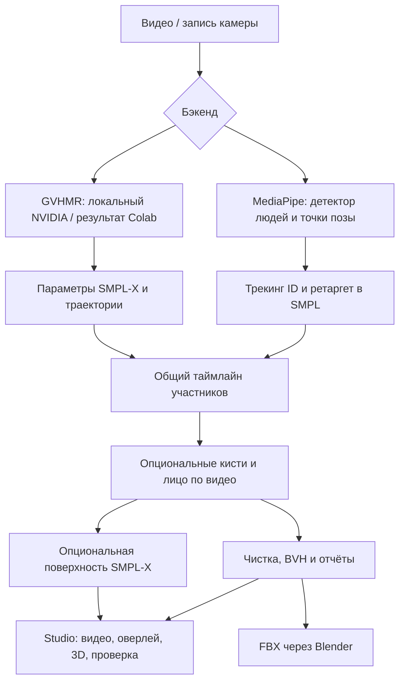
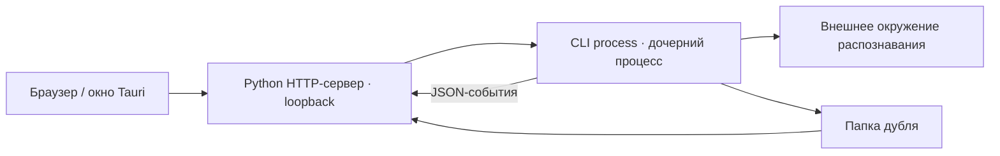

# Архитектура MoCapGate

Актуальная схема для 0.3.1. Пользовательские инструкции: [русский README](../README.md) · [English README](../README.en.md).

## От видео до анимации

- **MediaPipe:** `core/pose_worker.py` выполняет распознавание в отдельном venv. Для одного человека используется видеотрекинг; для группы `core/person_detector.py` выделяет области людей, а `core/person_tracking.py` связывает наблюдения с ID. `core/retarget.py` переводит точки в повороты SMPL и оценивает положение таза и фокус. При плохо видимых ногах автоматически включается верх тела.
- **GVHMR:** `core/gvhmr_runner.py` запускает отдельное окружение NVIDIA без рендера. `core/gvhmr.py` читает `.pt`, `.npz`, JSON и сцены с несколькими людьми. В Colab применяется тот же адаптер и BVH-конвертер; ноутбук генерируется `tools/build_colab.py`. Внешний GVHMR и веса не входят в репозиторий.
- **Детали:** `core/details.py` и `detail_worker.py` привязывают кисти и лицо к участникам видеоряда. `hand_bvh.py` добавляет пальцы. JSON сохраняет наблюдения и пропуски, не превращая их в подтверждённые детекции.
- **Чистка:** `filters.py` — One Euro; `cleanup.py` — фиксация стоп коррекцией корня, без полноценного IK. Верх тела и движение на месте отключают фиксацию стоп.
- **Выход:** `smpl_bvh.py` переводит параметры в BVH, `mixamo.py` задаёт имена и фиксированные окончания цепочек, `blender_io.py` конвертирует BVH в FBX и открывает в Blender/Maya.
- **Поверхность:** отдельный `mesh_worker.py` с torch/smplx создаёт локальные данные нейтрального аватара. `expressive.py` и `face_fit.py` подгоняют детали приблизительно. Поверхность не экспортируется кнопками BVH/FBX.

## Studio и процессы

Сервер `apps/studio/server.py` работает на стандартной библиотеке. Интерфейс `ui/` не требует сборки: `studio.js` содержит логику и RU/EN, `viewer3d.js` использует three.js. Tauri-оболочка находит Python, запускает сервер и открывает его адрес; вычислительное ядро остаётся Python.

Долгие задачи выполняются дочерними процессами; Studio читает JSON-события и позволяет отменить обработку. MediaPipe, GVHMR и torch/smplx используют собственные окружения, поэтому их зависимости не нужны для запуска ядра, демо и просмотра готовых BVH.

## Дубль и кэш

`core/pipeline.py` создаёт папку в библиотеке. `take.json` содержит ID, бэкенд, опции и ссылки на результат каждого участника. Видео копируется в дубль; неподходящий для просмотра видеоряд по возможности нормализуется FFmpeg. Кэш MediaPipe зависит от модели, предела людей и версии конвейера. Смена этих параметров вызывает новое распознавание; сглаживание, фокус и движение корня переиспользуют кэш.

Групповые результаты имеют общий FPS и длину; вне наблюдаемого интервала экспорт удерживает позу, а просмотр скрывает участника. Имена файлов и покрытие деталей нужно читать из метаданных, а не предполагать один фиксированный набор.

## Локальный доступ и сеть

Сервер слушает `127.0.0.1`, проверяет Host на loopback, требует токен сессии для API, принимает изменяющие POST-запросы как JSON. Внешние ссылки ограничены списком допустимых адресов. Удаление дубля — перенос в `.trash`.

Локальный захват не загружает видео в облако. При установке скачиваются инструменты, библиотеки и модели. `scripts/vendor_web.py` сохраняет three.js и MediaPipe Tasks Vision для офлайн-работы; без этих файлов сервер перенаправляет запросы библиотек на CDN. Пользователь сам загружает видео и SMPL-X в Google Colab, если выбирает этот бэкенд.

## Границы системы

С одной камеры глубина и перекрытые суставы неоднозначны. Общая сцена группы не гарантирует точные контакты или взаимные мировые позиции. Совпадение имён с Mixamo помогает сопоставлению, но ретаргет на целевого персонажа и запекание выполняются в Blender/Maya. MeshGate — необязательный соседний инструмент, не зависимость MoCapGate.
