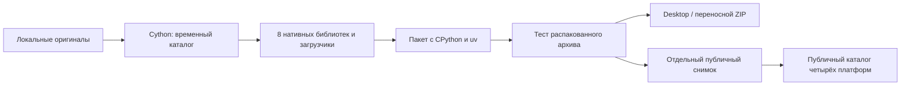

# Нативная упаковка MoCapGate

Релиз **0.3.2** содержит отдельные нативные сборки **macOS ARM64, macOS Intel x64,
Windows x64 и Linux x64** со встроенным **CPython 3.12.13**. Восемь реализаций
заменяются загрузчиками в выходных пакетах и публичном снимке. Оригиналы и
прежняя история сохраняются в приватном репозитории и проверенных резервных копиях.

MoCapGate остаётся **MIT**. Компиляция усложняет изучение реализации, но не
запрещает клонирование, анализ бинарников или разрешённое лицензией использование.
Активация и смена лицензии в эту работу не входят. [English](code-protection.en.md).

## Какие модули компилируются

Источник списка — `native-modules.json`.

| Модуль | Назначение |
|---|---|
| `mocapgate.py` | CLI, запуск Studio, создание и обработка дублей |
| `apps/studio/server.py` | HTTP API, задачи и отмена процессов |
| `core/pipeline.py` | обработка дубля, выбор бэкенда, экспорт |
| `core/retarget.py` | преобразование позы в скелет |
| `core/cleanup.py` | очистка движения |
| `core/report.py` | оценка качества |
| `core/components.py` | обнаружение и установка компонентов |
| `core/details.py` | обработка деталей движения |

Библиотека лежит рядом с соответствующим загрузчиком. Это сохраняет пути,
вычисляемые из `__file__`. Загрузчик проверяет ОС, архитектуру и CPython ABI;
манифест содержит SHA-256 библиотек, которые проверяются перед упаковкой.

Не компилируются `pose_worker`, `detail_worker`, `mesh_worker`, `gvhmr_runner`,
`blender_io` и их вспомогательные модули: они работают в независимых окружениях
MediaPipe, PyTorch/GVHMR, SMPL-X и встроенном Python Blender. Конвертация GVHMR,
BVH/SMPL, скелет и вращения остаются исходниками для автономного Colab-ноутбука.
Интерфейс JavaScript также остаётся доступным; секретов в нём нет.



## Сборка из локальных оригиналов

Нужны C/C++-компилятор и CPython **3.12.13**. На Windows — MSVC Build Tools.
`requirements-native.txt` фиксирует Cython, setuptools, uv и zstandard.
Поставляемый Python скачивается через закреплённый uv; тексты лицензий Python
и его зависимостей берутся из соответствующего полного архива
[python-build-standalone](https://github.com/astral-sh/python-build-standalone/blob/main/docs/distributions.rst).
Сведения о происхождении сохраняются в `python-licenses/provenance.json`.

```bash
uv python install 3.12.13
uv venv --python 3.12.13 .venv-native
uv pip install --python .venv-native/bin/python -r requirements-native.txt
.venv-native/bin/python scripts/native_packaging.py build --out dist/native-package
.venv-native/bin/python tests/test_native_package.py dist/native-package --require-blender
.venv-native/bin/python scripts/native_packaging.py zip dist/native-package --out dist/MoCapGate-native.zip
```

Windows использует `.venv-native\Scripts\python.exe` вместо `.venv-native/bin/python`.
Выходная папка должна быть новой: сборщик не перезаписывает существующий пакет.
Для другой ОС/архитектуры повторите сборку на целевой системе. Собирать оригиналы
из публичных загрузчиков нельзя — сборщик это отклоняет.

Пакет содержит `START.sh` или `START_WINDOWS.cmd`. Для CLI используйте
`python/bin/python3.12 mocapgate.py …` на macOS/Linux и
`python\python.exe mocapgate.py …` на Windows. Установленный системный Python не нужен.
Модели, AI-окружения и Blender устанавливаются отдельно по прежнему порядку.

Desktop собирается из проверенного пакета:

```bash
export MOCAPGATE_NATIVE_PACKAGE="$PWD/dist/native-package"
cd apps/studio/desktop
npm ci
npx tauri build
```

На PowerShell: `$env:MOCAPGATE_NATIVE_PACKAGE = (Resolve-Path dist/native-package).Path`.
Tauri включает только этот пакет; при нативном запуске оболочка использует его
Python и не переходит молча на системный интерпретатор.
`make_portable.py` требует `--native-package`; `--source` оставлен только для
явной локальной упаковки исходников, которая не должна публиковаться как нативный релиз.

## Проверки

`tests/test_native_package.py` создаёт ZIP, распаковывает его в новую временную
папку, сохраняет права исполняемых файлов и запускает встроенный Python с PATH,
в котором отсутствует системный Python. Проверяются HTTP Studio, локальные
web-библиотеки, GVHMR JSON → BVH для нескольких людей, демо, создание и повторная
обработка дубля, ошибка отсутствующего входа, отмена задачи, затем существующий
набор unit-тестов на распакованных библиотеках. При найденном Blender проверяется
настоящий FBX; `--require-blender` запрещает пропуск этой проверки.

Каждая из четырёх платформ собрана и проверена на своём CI runner: распакованный
пакет, встроенный Python, Studio HTTP, BVH, отмена задач, реальный FBX через Blender
и unit-тесты. macOS ARM64 также проверена локально; настоящий ролик Sports2D дал
230 кадров, два стабильных ID и два BVH. Оценка 32/100 проверяет выполнение,
а не точность mocap. Подпись и нотарификация не выполнялись.
См. [журнал проверок](native-verification.md).

Исходники компилируются из приватного зеркала через read-only deploy key.
В публичный CI попадают только проверенные бинарные артефакты; ключ и
промежуточный C не публикуются. Рабочие workflow контроллера находятся в
[MaverickGH/app-releases](https://github.com/MaverickGH/app-releases/tree/main/.github/workflows).

Проверка содержимого отклоняет оригиналы выбранных модулей, неверные SHA-256,
выходы за корень пакета, `.c/.cpp/.pyx`, `.pdb`, `.map`, `.dSYM` и Python-кэши.
Генерируемый C и промежуточные объектные файлы существуют только во временной
папке компилятора. Лицензии приложения, Python, uv и остальных компонентов сохраняются.

## Локальная ветка, резервная копия и Git

Оригиналы находятся в локальной ветке `codex/local-development`. Перед изменениями
вне репозитория сохранены и проверены `history.bundle`, рабочее дерево, patch,
настройки Git и все файлы последнего релиза из обоих GitHub-репозиториев.
Контрольные суммы находятся в `SHA256.json`, сведения — в `backup.json`.

Для восстановления истории в отдельную папку:

```bash
git clone /path/to/backup/history.bundle restored-mocapgate
# Рабочие незакоммиченные файлы восстановите из working-tree.tar.gz поверх клона.
```

У origin сохранён fetch URL, но локальный push URL заменён на
`disabled://mocapgate-local-source`. `.git/hooks/pre-push` запускает
`scripts/check_public_snapshot.py`: исходная ветка отклоняется, а для других
веток проверяется **каждый достижимый коммит**, а не только чистый верхний.
Это локальная защита от ошибки; hooks не переносятся автоматически при клонировании
и не являются серверным контролем доступа.

Публичный снимок создаётся в отдельной новой папке, без `.git`:

```bash
python3 scripts/native_packaging.py snapshot dist/native-package --out /path/outside/repo/public-preview
```

Публичный снимок содержит каталог `native-manifests` для четырёх платформ и
соответствующие библиотеки рядом с загрузчиками. Python для клонированного
репозитория должен быть строго 3.12.13; переносной ZIP и установщики уже
содержат подходящий интерпретатор. Оригинальный checkout не заменяется.

Перезапись публичной истории разрешена владельцем проекта. Новый корневой
коммит заменяет публичные ветки через `--force-with-lease`. Старые теги
содержат архивные описания, а прежние файлы релизов сохраняются. Старые SHA,
загруженные исходники и внешние копии могут остаться доступными; компиляция
не отзывает ранее выданные права MIT.
