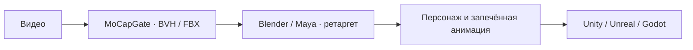

# Анимация MoCapGate в игровых движках

MoCapGate выдаёт анимацию скелета, которую нужно согласовать с персонажем проекта. MeshGate для этого не обязателен.

1. Проверьте движение в Studio и выберите ID.
2. Получите BVH или FBX; для FBX Studio использует Blender.
3. Перенесите движение на свой риг в Blender/Maya и запеките его.
4. Экспортируйте персонажа или анимационный клип в формат, поддерживаемый вашим движком.
5. В движке проверьте сопоставление скелета, масштаб, FPS и импорт root motion. Для клипа на месте выберите соответствующий режим корня в дубле.

Можно импортировать FBX-скелет и сопоставить его средствами движка, если ваш процесс это поддерживает. Совпадение имён с Mixamo не гарантирует совпадения пропорций и позы покоя.

Поверхность аватара SMPL-X и лицевые blendshape-каналы в BVH/FBX не включены. Прямой экспорт glTF-анимации пока в [роадмапе](../../docs/roadmap.md).

[Полное руководство на русском](../../README.md) · [English guide](../../README.en.md) · [MeshGate](https://github.com/MaverickGH/meshgate).
